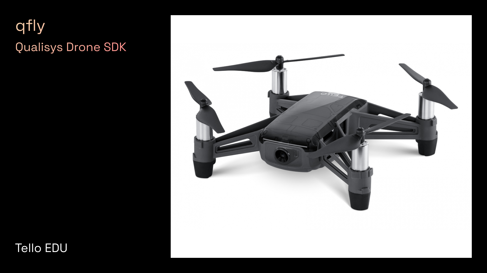

# Qualisys Drone SDK

qfly | Qualisys Drone SDK is a Python library to track and fly drones with [Qualisys motion capture systems](https://qualisys.com/). It is is designed to be an entry point for students, researchers, engineers, artists, and designers to develop drone applications. 

**STATUS: DEV PREVIEW** :: Development and testing is ongoing for many features. For bug reports, feature requests, and other contributions, please use [Issues](https://github.com/mbaytas/qualisys_drone_sdk/issues) and [Discussions](https://github.com/mbaytas/qualisys_drone_sdk/discussions). For completed, ongoing, and future development, see [Projects](https://github.com/mbaytas/qualisys_drone_sdk/projects).

qfly is architected as a concurrent wrapper for the [Qualisys Python SDK](https://github.com/qualisys/qualisys_python_sdk) along with Python SDKs for popular drone platforms like [Bitcraze Crazyflie](https://www.bitcraze.io/products/crazyflie-2-1/) and [Ryze Tello EDU](https://www.ryzerobotics.com/tello-edu). It significantly reduces the software development workload compared to using vanilla SDKs. For creative applications like drone shows, light painting, and cinematography, movements can be easily programmed by non-engineers using principles of keyframe animation. For interactive applications like games and exercise, qfly is able to ingest signals and control drones in real time.

Various safety, stability, and convenience measures are built in, including:

- geofencing
- speed limits
- smooth takeoff and landing
- interrupt and land

qfly can control swarms comprising an arbitrary number and combination of drones, e.g. [Bitcraze Crazyflie](https://www.bitcraze.io/products/crazyflie-2-1/) and [Ryze Tello EDU](https://www.ryzerobotics.com/tello-edu) drones can be flown together.

### Requirements

- [Python](https://www.python.org/) 3.10 or equivalent
- Python packages (install using [pip](https://pypi.org/project/pip/)):
    - [qtm](https://github.com/qualisys/qualisys_python_sdk) (Qualisys Python SDK) 2.1.1 or equivalent
    - [cflib](https://github.com/bitcraze/crazyflie-lib-python) (for Crazyflie Drones) 0.1.18 or equivalent

qfly has been designed and tested on Windows. It may or may not work on other operating systems.

### Setup

To install qfly DEV PREVIEW:

1. Clone the [qfly source code](https://github.com/qualisys/qualisys_drone_sdk) to your local machine.
2. Navigate to the package root directory and install the qfly package in "development mode" by running: `python -m pip install -e .`

# Drone Platforms and Example Scripts

## Bitcraze Crazyflie

### Requirements

- [Bitcraze Crazyflie 2.1](https://www.bitcraze.io/products/crazyflie-2-1/)
- For tracking: For best results, we recommend the [Active Marker Deck](https://store.bitcraze.io/collections/decks/products/active-marker-deck). Alternatively, a [Motion Capture Marker Deck](https://store.bitcraze.io/collections/decks/products/motion-capture-marker-deck) is available. Markers can also be mounted on the drone by hand.

### Setup

- Install drivers for both Crazyflie and the Crazyradio dongle using [Zadig](https://zadig.akeo.ie/) following [Bitcraze's instructions](https://www.bitcraze.io/documentation/repository/crazyradio-firmware/master/building/usbwindows/).
- To fly multiple drones, assign different radio addresses to them using the [Crazyflie PC client](https://github.com/bitcraze/crazyflie-clients-python). Refer to "Firmware Configuration" in the [Crazyflie PC client docs](https://www.bitcraze.io/documentation/repository/crazyflie-clients-python/master/userguides/userguide_client/).\
    - This can be done over the Crazyradio (requires you to know the current radio address, see Bitcraze docs) or over USB (requires Crazyflie driver, see above).
- **Before takeoff with the Crazyflie, always place the drone(s) flat on the floor, with the front pointing in the positive x-direction of the QTM coordinate system.**

### Example script: [cf_solo.py](examples/cf_solo.py)

This script demonstrates a basic scenario using the Qualisys motion capture system to control the flight path of a Crazyflie. The script commands the Crazyflie to:

1. Take off and hover at the center of its airspace
2. Circle around the Z axis
3. Circle around the Y axis
4. Circle around the X axis
6. Come back to center, land carefully

Press `Esc` to stop the program and attempt to calmly land the drone. 

### Example script: [cf_multi_1.py](examples/cf_multi_1.py)

This script demonstrates a semi-choreographed "swarm" flight with multiple Crazyflie drones.

The drones execute movements that are very similar to the solo script.

Press `Esc` to stop the program and attempt to calmly land the drones.

*Notice: The swarm scripts have so far been tested with 3 drones. They may or may not work with more drones. Testing with larger swarms is in progress. *

### Example script: cf_interactive.py

Coming soon...

<!-- This script demonstrates real-time interactive control of a Crazyflie, coupling the drone's flight to the position of another object.

In addition to the drone, it requires a "controller" rigid body configured in QTM. We recommend the [Qualisys Traqr range](https://www.qualisys.com/accessories/traqr/).

Press `Esc` to stop the program and attempt to calmly land the drone.  -->

## Tello EDU

Coming soon...

---

# Resources and Inspirations

- Tutorial on [Building Interactions with the Bitcraze Crazyflie and Motion Capture](https://www.baytas.net/blog/crazyflie) by Mehmet Aydın Baytaş
- Fun project: [Santa's Flying Helpers](https://www.bitcraze.io/2021/12/santas-flying-helpers/) by Bitcraze
- [Overview of different positioning systems](https://www.bitcraze.io/2021/05/positioning-system-overview/) you can use with the Bitcraze Crazyflie
- [Notes on the design of Drone Chi](https://www.bitcraze.io/2019/12/designing-dronechi/), a meditative human-drone interaction experiment by Joseph La Delfa
